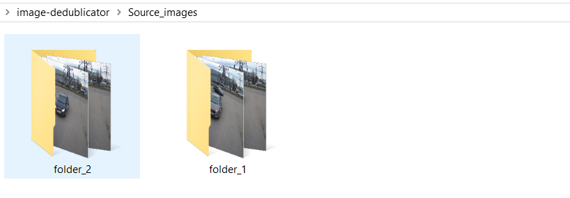
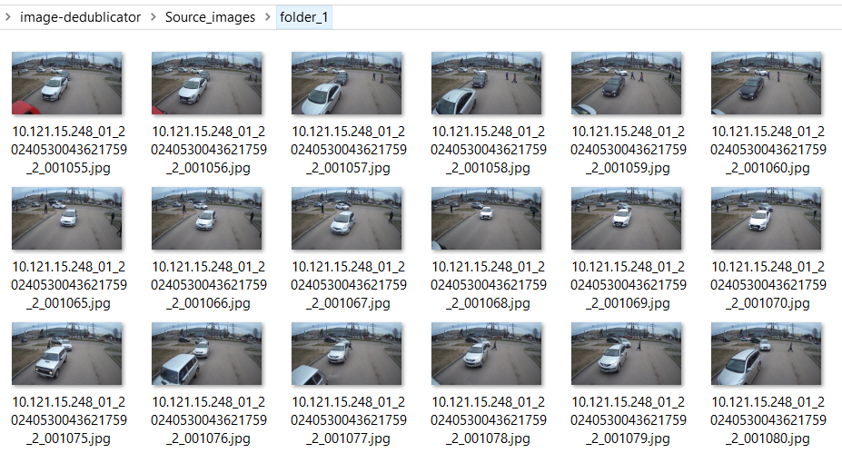
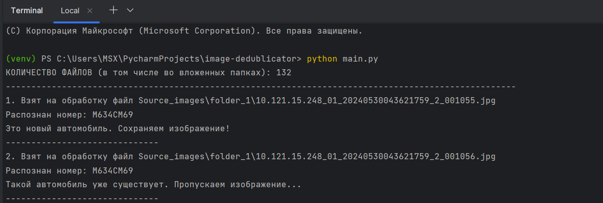
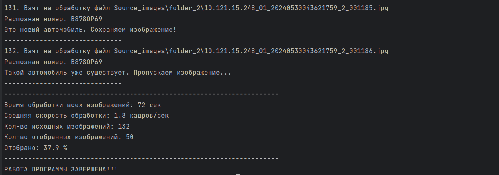
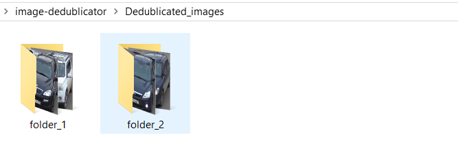
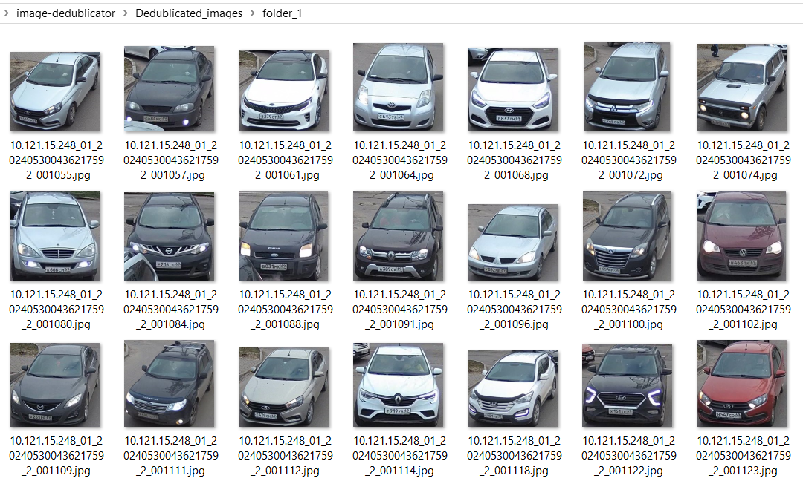

## Как пользоваться
### Настройте объект класса ImageDedublicator
Необходимо в переменную `source_folder` записать директорию к вашим изображениям (можно в подпапках)  
Настроить атрибуты экземпляра класса ImageDedublicator:  
 - указать в `camera_id` номер камеры (одну из 247, 248, 249, 252)

Метод `process.run()` запускает процесс отбора изображений.  

```python
source_folder = 'Source_images'

process = ImageDedublicator(source_dir=source_folder,
                            camera_id=248)

process.run()
```

## Алгоритм работы программы:  
1. Пользователь указывает директорию к изображениям в переменной `source_folder`.  
2. Указывает номер камеры в атрибутах экземпляра класса ImageDedublicator.  
3. Запускает код программы `main.py`.  
4. Программа получает все пути к изображениям, указанным в `source_folder`.  
5. В цикле происходит обработка каждого изображения.  
6. В зависимости от номера камеры в `camera_id` применяется нужная зона интереса для каждого текущего изображения.    
7. В зоне интереса обнаруживается и распознаётся номер автомобиля.   
8. Распознанный номер сохраняется в список распознанных номеров.  
9. Если распознанного номера еще нет в списке распознанных номеров, то сохраняем изображение в виде вырезанного bbox автомобиля.  
10. В конце выводим сводную статистику по работе программы.  

## Исходные изображения (пример расположения):  


## Исходные изображения (в одной из папок):  


## Старт работы программы (в терминале):  


## Конец работы программы со статистикой (в терминале):  


## Выходные изображения (пример расположения):  


## Выходные изображения (в одной из папок):  


## Установка:  
1. Клонируйте репозиторий себе на компьютер
2. Откройте папку проекта в любой IDE. Убедитесь, что в терминале вы находитесь в папке проекта
3. Создайте виртуальное окружение  
```shell
python -m venv venv
```
4. Перейдите в виртуальное окружение и активируйте его
```shell
venv\Scripts\activate
``` 
5. Установите все необходимые библиотеки 
```shell
pip install -r requirements.txt
```
6. Запустите код на выполнение
```shell
python main.py
```
